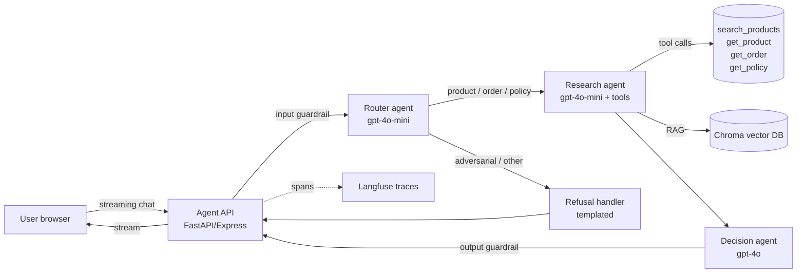

# RFC: Agentic Search v1

**RFC #**: 042
**Authors**: A. Reyes (Eng), J. Park (PM)
**Reviewers**: S. Patel (Eng Director), K. Ahmed (Security), L. Chen (Search Platform), R. Diaz (CX)
**Status**: Approved 2026-05-15
**Implements**: [System memo](system-memo.md) | **Justifies**: [Business case](business-case.md)

> 💡 **Why RFCs exist**
> A system memo says *what*. An RFC says *how*, and forces explicit choices between alternatives. RFCs save the team from re-litigating decisions in standups.

---

## Summary

We will ship a multi-agent retail copilot with a Router → Research → Decision topology, RAG over products + policies + FAQs via Chroma, and a deterministic guardrail layer wrapping all LLM interactions. Pilot on 10% of .com traffic for 4 weeks before a GA decision.

---

## Goals

- Translate fuzzy natural-language shopping queries to grounded product + policy answers.
- Hold p95 ≤ 4s and cost ≤ $0.03/query at projected GA volume.
- Reach helpfulness ≥ 4.0 / 5 and safety ≥ 0.95 on a 50+ case labeled eval before pilot.

## Non-goals

- Personalization beyond session context (deferred to v2).
- Multilingual support (deferred).
- Mutating actions (refunds, account changes, order modifications) — these stay with existing tools.

---

## Architecture

### Component summary

| Component | Tech | Why |
|-----------|------|-----|
| Web client | Next.js + Vercel AI SDK | Streaming UX, edge-friendly |
| Agent API | FastAPI (Python) | Existing team expertise; rich LangChain ecosystem |
| Router agent | gpt-4o-mini | Cheap; classification is well within its capability |
| Research agent | gpt-4o-mini w/ tool use | Cost-quality sweet spot for tool selection |
| Decision agent | gpt-4o | User-facing prose quality matters here |
| Vector DB | Chroma (pilot) → Qdrant Cloud (GA) | Chroma for fast iteration; Qdrant for managed scale |
| Embeddings | text-embedding-3-small | $0.02/M tokens; sufficient quality on our eval |
| Observability | Langfuse self-hosted | Vendor-neutral; OSS; full trace tree |
| CI evals | GitHub Actions + custom harness | Blocks merges on threshold breach |

### Data flow per request

1. **Input guardrail** (~5ms): regex screen for prompt injection, refund-baiting, PII; mask order IDs.
2. **Router** (~600ms p95): classifies intent + suggests tool plan.
3. **Branch**:
   - If `other` or `must_refuse`: refusal handler returns a templated decline.
   - Else: Research agent runs.
4. **Research** (~1.2s p95): ReAct loop, up to 6 steps, calling tools/RAG as needed.
5. **Decision** (~1.5s p95, streamed): composes warm user-facing copy from research output.
6. **Output guardrail** (~5ms): pattern-match forbidden promises.
7. **Stream** to client; emit Langfuse trace.

---

## Alternatives considered

### Alt 1 — Single agent with a giant system prompt

**Pros**: simpler, fewer LLM hops, lower latency.
**Cons**: prompt becomes a conditional mess as scope grows; can't run cheap models on cheap steps; harder to A/B individual capabilities.
**Verdict**: rejected. The Router/Research split is worth the +600ms because it isolates failure modes.

### Alt 2 — Third-party shopping assistant SaaS

**Pros**: faster to launch; vendor owns ops.
**Cons**: limited prompt control; data residency questions; per-query pricing 3-5× our internal model; no eval ownership.
**Verdict**: rejected for v1. Revisit if internal effort slips beyond 12 weeks.

### Alt 3 — LangGraph throughout vs hand-rolled state machine

**Pros of LangGraph**: typed state, conditional edges, persistence, replay.
**Cons**: framework lock-in; some debug-time friction.
**Verdict**: LangGraph wins. The Router → Research → Decision routing is exactly the graph LangGraph models cleanly.

### Alt 4 — Anthropic Claude as primary model vs OpenAI/Gemini

**Pros of Claude**: best long-context, strongest prompt caching, native MCP.
**Cons**: weaker integration with our existing Python stack; legal review for adding a new provider isn't yet complete.
**Verdict**: OpenAI + Gemini for v1; add Claude in v2 once procurement approves.

---

## Detailed design notes

### Tool contracts

See [tool-contracts.md](tool-contracts.md) for the full table. Summary:

- All tools have JSON-schema inputs validated server-side before invocation.
- Errors return `{error: "validation_failed" | "not_found" | "tool_exception", details?}` — never raise.
- Latency budgets: search_products ≤ 200ms, get_order ≤ 300ms, get_policy ≤ 50ms (file read).

### RAG design

See [rag-design.md](rag-design.md). Highlights:

- Products: one chunk per SKU (preserves SKU↔price↔stock linkage).
- Policies: 600-char chunks, 80-char overlap.
- FAQs: one Q&A per chunk.
- Default k=5; agentic path may union up to 15 unique chunks across query rewrites.

### Guardrails

See [eval-and-guardrails-spec.md](eval-and-guardrails-spec.md). Two layers:

1. **Pre-LLM (regex)** — fast, deterministic, no false negatives on the patterns we list.
2. **Post-LLM (regex + heuristic)** — forbidden promises, currency-with-percent, "I'll refund you" style phrases.

LLM-based output classifier is a v1.1 addition once we have telemetry to tune it on.

### Observability

Every request emits one Langfuse trace with nested spans per agent + per tool call. PII (full names, emails) is masked before logging; order IDs are masked in prompts but stored raw in a separate audit log keyed by `request_id`.

### Failure handling

| Failure | Behavior |
|---------|----------|
| Router model timeout | Fall through to "I can help with catalog/orders/policies — what are you looking for?" |
| Research max-steps exceeded | Decision gets partial results + flag; final answer notes incompleteness |
| Provider 429/500 | Tenacity-style retry (3 attempts, exponential); if all fail, multi-provider failover |
| Vector DB unreachable | Skip RAG, return tool-only answer if possible, else escalate |
| Both providers down | Open circuit breaker; serve cached "we're having trouble, please use search/contact us" |

---

## Rollout plan

| Phase | Traffic | Gates | Duration |
|-------|---------|-------|----------|
| Internal dogfood | 0% live, ~50 employees | Eval suite ≥ thresholds | 1 week |
| Soft pilot | 1% of .com traffic, sample of intents | No P0 incidents in dogfood | 1 week |
| Pilot | 10% of .com traffic, all intents | Helpfulness ≥ 4.0, no P0 in soft pilot | 4 weeks |
| GA decision | — | All success criteria from system-memo §7 | — |
| GA | 100% | Approved by VP P + Eng Director | Ongoing |

### Kill switches

1. **Feature flag** at the API layer turns the copilot off in <60s; UI gracefully falls back to faceted search.
2. **Daily LLM spend cap** auto-disables on breach; PagerDuty wakes on-call.
3. **Eval threshold breach** in CI blocks merges (not deployment to prod, but new code can't go in).

---

## Open questions

| # | Question | Owner | Resolve by |
|---|----------|-------|------------|
| 1 | Show citations to end users or only in logs? | Design + Trust | Pilot week 2 |
| 2 | Personalization: use 30-day history or session-only? | Privacy review | Pilot week 1 |
| 3 | Failover: prefer Gemini or OpenAI as primary? | Ops | Dogfood week |
| 4 | Reranker model: bge-base or skip for v1? | Eng | Dogfood week |

---

## Out-of-scope (v1.1 candidates)

- Personalization across sessions.
- Image search.
- Cross-language support.
- Multi-cart actions ("add these 3 to cart").
- A/B testing prompt variants in production.

---

## Appendix: capacity & cost model at GA scale

- 500K queries/month assumed.
- 70% hit Research+Decision (full stack), 20% hit Router→Refusal (cheap), 10% hit Router only (cache).
- Average tokens: 4.8K prompt + 380 completion (Decision dominates).
- Projected blended cost: $0.025/query → $12.5K/month LLM spend.
- Headroom: if average completion grows 50%, still under $0.04/query.

---

## How this gets out of date

- Section "Alternatives" should be re-reviewed when a major new provider/framework ships.
- "Rollout plan" gets archived after GA; replace with the runbook.
- "Open questions" should be empty before GA. If not, each one needs an owner and a date.
